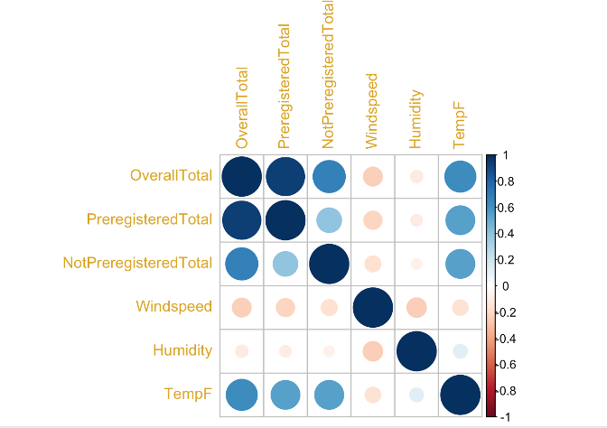
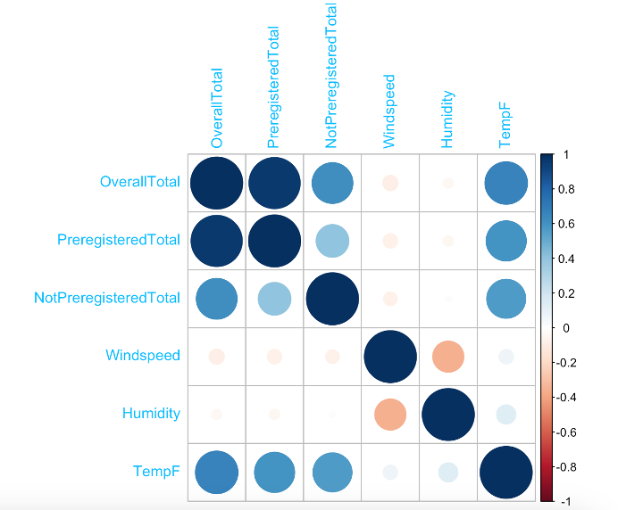
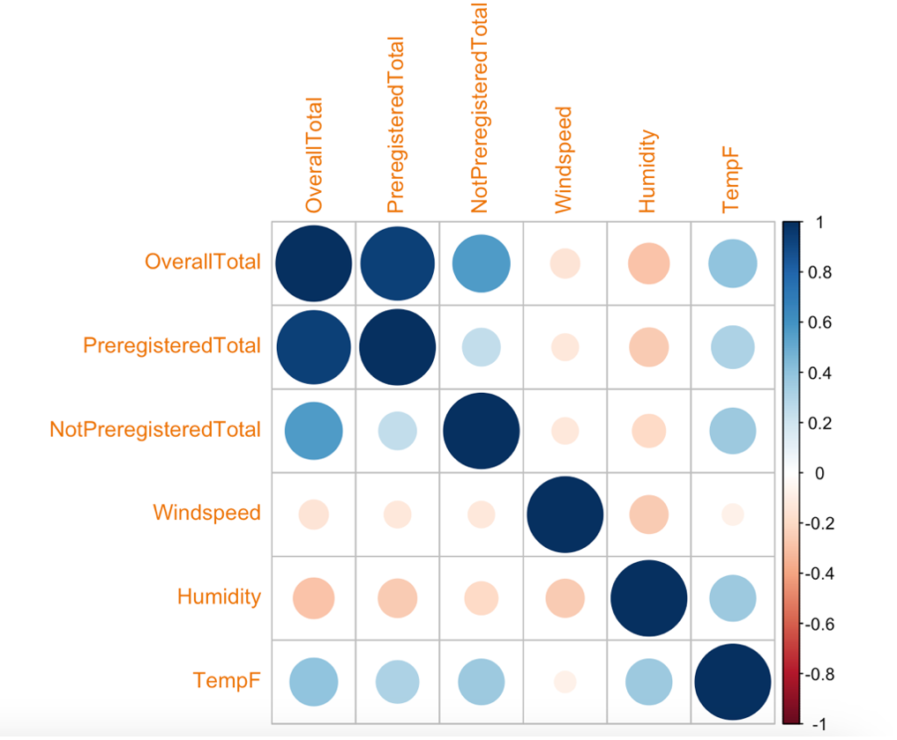

# Bike Rental Correlation Analysis

## Overview

This analysis uses R Studio to examine relationships between bike-sharing rental activity and environmental variables including temperature, humidity, and windspeed. The objective was to identify which factors have the strongest influence on rider demand and determine how these relationships change across seasons using correlation analysis and statistical visualization.

## Tools Used

R Studio

corrplot Package

Statistical Analysis

Correlation Analysis

## Business Questions

### Which environmental variables have the strongest relationship with bike rental demand?

Analyzed correlations between rental activity and weather-related variables including temperature, humidity, and windspeed.

### Do rider behavior patterns differ by season?

Created separate correlograms for winter, spring, summer, and fall to compare relationships between variables across seasons.

### Which season exhibits the most unique rental behavior?

Compared seasonal correlation structures to identify deviations in rider behavior and environmental impacts.

### How strongly are registered and non-registered rider totals related to overall demand?

Examined correlations between rider categories to better understand the composition of total rental activity.

### How do environmental factors interact with one another?

Evaluated relationships between temperature, humidity, and windspeed to better understand their combined influence on bike rental demand.

## R Techniques Demonstrated

* Correlation Analysis
* Correlograms
* Seasonal Segmentation
* Data Subsetting
* Statistical Visualization
* Exploratory Data Analysis

## Skills Demonstrated

* R Programming
* Statistical Analysis
* Correlation Analysis
* Exploratory Data Analysis
* Data Visualization
* Data Storytelling
* Business Intelligence
* Trend Analysis

## Visualizations

### Overall Correlation Matrix

### Winter Correlation Matrix

### Spring Correlation Matrix

### Summer Correlation Matrix

### Fall Correlation Matrix

